# Hi there! 👋 I'm Cláudio Jesus

<div align="center">
  
</div>

<div align="center">
  
  
  
</div>

---

## 🚀 About Me

I'm a **Frontend Developer** passionate about creating beautiful, functional web experiences. I specialize in **React** and modern JavaScript ecosystems, with a strong focus on user experience and performance optimization.

```javascript
const claudio = {
    location: "Pinhal Novo, Portugal",
    currentRole: "Senior Frontend Developer",
    technologies: {
        frontend: ["React", "Next.js", "TypeScript", "JavaScript"],
        styling: ["CSS3", "SASS", "Material-UI", "Tailwind CSS"],
        tools: ["Git", "VS Code", "Figma", "Chrome DevTools"],
        learning: ["Three.js", "GraphQL", "Docker", "AWS"]
    },
    currentFocus: "Building scalable React applications",
    funFact: "I debug with console.log and I'm not ashamed! 🐛"
};
```

---

## 🛠️ Tech Stack

<div align="center">

### Frontend Development


### Styling & Design


### Backend & Tools


</div>

---

## 📊 GitHub Stats

<div align="center">
  
  
</div>

<div align="center">
  
</div>

---

## 🎯 Current Focus

```mermaid
graph LR
    A[🎯 Learning] --> B[Three.js]
    A --> C[GraphQL]
    A --> D[Docker]
    B --> E[🚀 Building]
    C --> E
    D --> E
    E --> F[Modern Web Apps]
    E --> G[Interactive Experiences]
    E --> H[Scalable Solutions]
```

<div align="center">



</div>

- 🔭 Currently working on **Liga dos Veteranos do Sado** - Football league management platform
- 🌱 Learning **Three.js** for 3D web experiences
- 👯 Looking to collaborate on **React/Next.js projects**
- 💬 Ask me about **React, JavaScript, and Frontend Development**
- ⚡ Fun fact: **I love turning coffee into code** ☕

---

## 🏆 Featured Projects

<div align="center">

| Project | Description | Tech Stack | Links |
|---------|-------------|------------|-------|
| 🏆 **Liga dos Veteranos** | Football league management platform | React, Node.js, MongoDB | [🔗 Live](link) [📱 Code](link) |
| 📚 **Benny's CheatSheet** | React component library | React, TypeScript, Storybook | [🔗 Live](link) [📱 Code](link) |
| 🍽️ **Restaurant Website** | Modern restaurant landing page | React, Gatsby, GraphQL | [🔗 Live](link) [📱 Code](link) |

</div>

---

## 📈 Contribution Graph

<div align="center">
  
</div>

---

## 🌟 Skills Breakdown

<div align="center">

### Programming Languages


### Frameworks & Libraries


</div>

---

## 🎨 Portfolio Highlights

<div align="center">
  <a href="YOUR_PORTFOLIO_LINK">
    
  </a>
  <a href="YOUR_BLOG_LINK">
    
  </a>
  <a href="YOUR_RESUME_LINK">
    
  </a>
</div>

### 🎯 What I'm Known For
- ✨ **Pixel-perfect implementations** from Figma designs
- ⚡ **Performance optimization** - improved load times by 40%+
- 🎨 **Modern UI/UX** with attention to detail
- 🔧 **Clean, maintainable code** with proper documentation
- 👥 **Team collaboration** and mentoring junior developers

---

## 💼 Professional Journey

```
🚀 Senior Frontend Developer @ TechCorp Solutions (2023 - Present)
   ├── Led development of React applications serving 10,000+ users
   ├── Improved performance by 40% through optimization
   └── Mentored 2 junior developers

💻 Frontend Developer @ StartupCo (2022 - 2022)
   ├── Built responsive web applications from design to production
   ├── Integrated payment systems and RESTful APIs
   └── Achieved 95% test coverage

🌱 Junior Frontend Developer @ Digital Agency (2021 - 2022)
   ├── Developed 25+ client projects
   ├── Achieved 98% client satisfaction rate
   └── Reduced development time by 30%
```

---

## 🤝 Let's Connect!

<div align="center">

[](YOUR_LINKEDIN)
[](YOUR_PORTFOLIO)
[](mailto:YOUR_EMAIL)
[](YOUR_TWITTER)

</div>

<div align="center">
  <h3>💡 "Code is like humor. When you have to explain it, it's bad." - Cory House</h3>
  
  
  
  <br><br>
  
  
</div>

---

<div align="center">
  <sub>💙 Built with love and lots of coffee ☕</sub>
</div>
